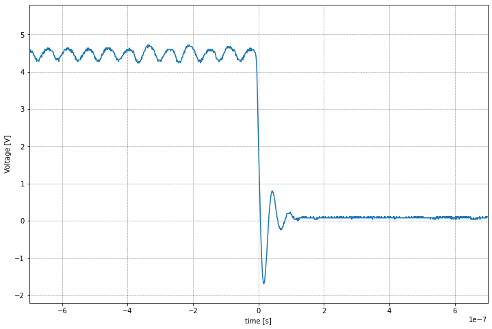
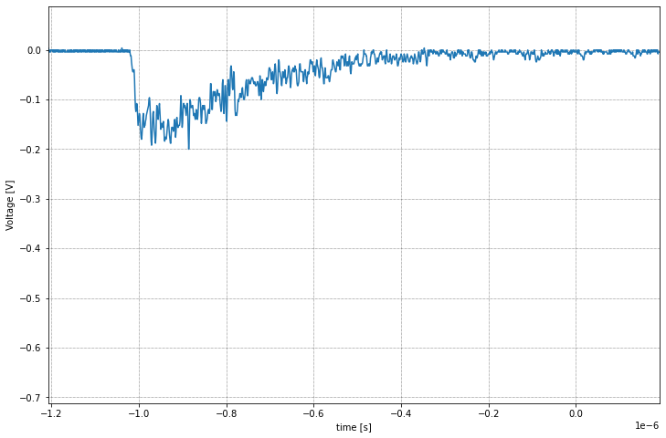
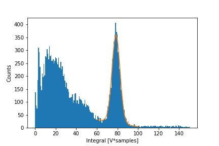
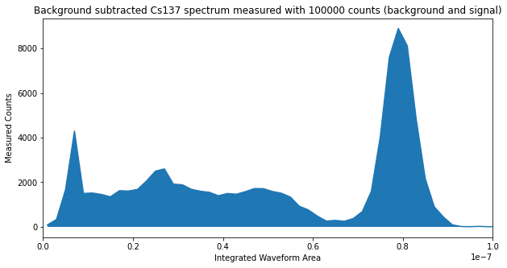

# Scope_DAQ
This repo contains simple jupyter notebooks for reading data from (currently only Siglent and Keysight) digital oscilloscopes using Python's pyvisa module.

Please see the headers in the jupyter with detailed instructions on how to install the dependencies and run the script.

Here are some semi-sexy images, to whet your appetite. 

### Trace from a square pulse waveform generator.

### Trace from a NaI(Tl) detector

### Spectrum acquired using the Siglent.ipynb.
The fit shows the photopeak from a 137Cs source.  Estimated resolution (sigma) -- 5%.

### Spectrum acquired using the Keysight.ipynb.
Spectrum from a Keysight DSOX3014G.

